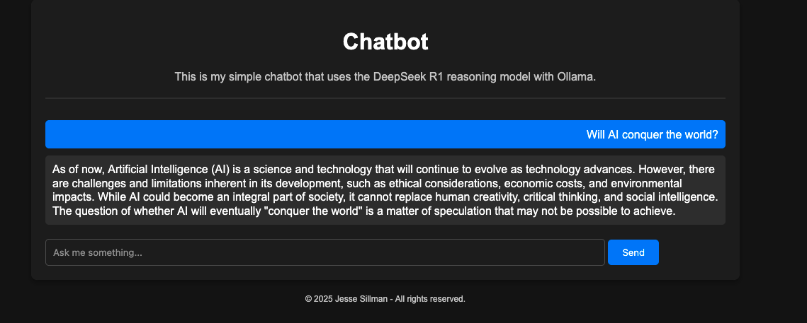

# Simple Chatbot using Ollama

I implemented a simple chatbot web application using Ollama, which allows you to download and
run models locally for efficient and private interactions. I used Python  with the Flask framework 
to create the `app.py` backend and HTML for the `templates/index.html` file to build the web interface.



## Features

- User-friendly interface for chatting
- Powered by the DeepSeek R1 reasoning model.
- Backend interaction with Ollama for generating responses.

## Structure

```
/ChatBot
├── app.py
└── /templates
    └── index.html
```

## How to run

### 1. Clone the repository

```bash
git clone https://github.com/jessesillman/chatbot
```

### 2. Install Ollama

Follow the official installaction instructions from [Ollama's website](https://ollama.com/download) for your platform.

Or on macOS using Homebrew:

```bash
brew install ollama
```

### 3. Download DeepSeek R1 model

By running:

```bash
ollama run deepseek-r1:latest
```

> You can replace `deepseek-r1:latest` with another model if wanted, but make sure to also update the `model`
parameter inside `app.py`.

### 4. Install Python Dependencies

Make sure you have Python 3 installed, then run:

```bash
pip install flask
```

### 5. Run the application

```bash
python app.py
```

 Open your browser and navigate to `http://127.0.0.1:5000/` to use the chatbot.

